# Gif Guide
## Get Going with Kendo UI & Vue

I am a big fan of Vue.js so I was delighted when the team said we would be supporting Kendo UI component wrappers for it 👏 Let's jump in and create an Vue application with the Vue CLI and add a color picker component. Here's what we'll be covering:

- Installing & creating a Vue app with the [Vue CLI](https://github.com/vuejs/vue-cli)
- Installing [Kendo UI components](http://demos.telerik.com/kendo-vue-ui/wrappers/)
- Adding Kendo UI [Default styling](http://themebuilder.telerik.com/kendo-ui)
- Implementing a Kendo UI [`ColorPicker`](https://docs.telerik.com/kendo-ui-wrappers-vue/components/colorpicker) component
- Where to go next :)

### Creating A Vue App

First, we need go to our terminal and globally (`-g`) install the [Vue CLI](https://github.com/vuejs/vue-cli) using `npm`.

```bash
npm install vue-cli -g 
```
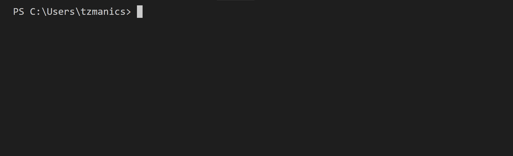

Now that the CLI tool is installed globally we can call on its commands from anywhere. So, let's head to the directory we want our new, awesome Vue ❤ Kendo UI project to live in. From here we can initiate the project with the command `vue init` with the template `webpack-simple` and project name `gif-guide_get-going-kenodui-vue`. You can choose your own [custom template](https://github.com/vuejs/vue-cli#custom-templates) or pick from one of the official templates listed on the [Vue CLI repo](https://github.com/vuejs/vue-cli#official-templates). Here's the list and descriptions that they have:

- **webpack** - A full-featured Webpack + vue-loader setup with hot reload, linting, testing & css extraction.
- **webpack-simple** - A simple Webpack + vue-loader setup for quick prototyping.
- **browserify** - A full-featured Browserify + vueify setup with hot-reload, linting & unit testing.
- **browserify-simple** - A simple Browserify + vueify setup for quick prototyping.
- **pwa** - PWA template for vue-cli based on the webpack template
- **simple** - The simplest possible Vue setup in a single HTML file

Of course, for the project name you can pick whatever your little heart desires 😘

```bash
vue init webpack-simple gif-guide_get-going-kendoui-vue
```

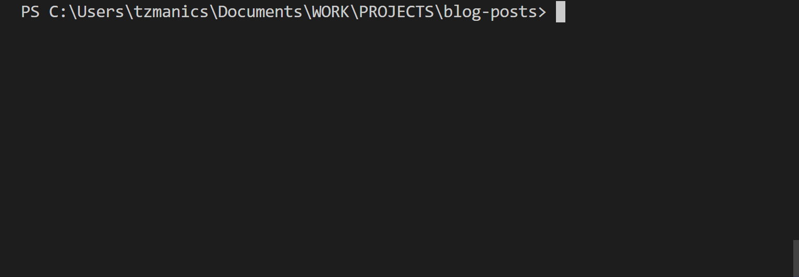

We now have a directory with our new project in there. Let's make sure everything is working the way it's supposed to by first heading into that directory then installing all our dependencies. We do this with the command `npm install` or just `npm i` for short.


Okay, if everything worked as it was supposed to we should be able to start up our app and see what it looks like. We can run `npm run dev` which is one of the scripts the Vue CLI has made for us. If you take a look in the `package.json` file you can see they actually supplied us with two npm scripts:

`package.json`
```json
...
  "scripts": {
    "dev": "cross-env NODE_ENV=development webpack-dev-server --open --hot",
    "build": "cross-env NODE_ENV=production webpack --progress --hide-modules"
  },
...
```
Both scripts are using `cross-env` ([here's](https://www.npmjs.com/package/cross-env) more info on that) but the `dev` script is using ['webpack-dev-server](https://webpack.github.io/docs/webpack-dev-server.html), a little Express server, and setting the `open` and `hot` flags. The `open` flag just opens the application in your default browser instead of you having to do it. The `hot` flag adds the [`HotModuleReplacementPlugin`](https://webpack.js.org/plugins/hot-module-replacement-plugin/) and switches the server to hot mode meaning it exchanges, adds, or removes modules while an application is running, without a full reload.  

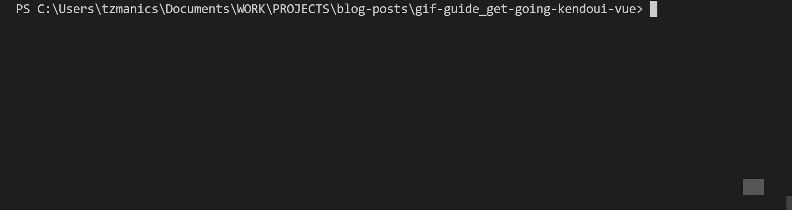

Since the `dev` script had the `open` flag your browser of choice should open up automatically and go to `localhost:8080` but you can always head there manually as well. Let's take a look at what we have so far.

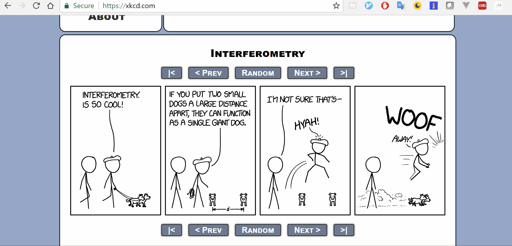

Lovely 😍

I really like to have a good place to go back to if/when 😁 I break things. So, we'll add git to version control our project by going into the project directory and running `git init`. Then we add all the new files by running `git add .` and make a commit of these changes with `git commit -m '<message here'>`. Next, we assign a remote repo on Github.com with the command `git remote add origin <url to repo>`. I had already created an empty repository on GitHub, you can check out how to do that [here](https://help.github.com/articles/create-a-repo/) or do it on [GitLab](https://docs.gitlab.com/ee/gitlab-basics/create-project.html). Finally, we push our changes to the repo on GitHub with, `git push origin master`.

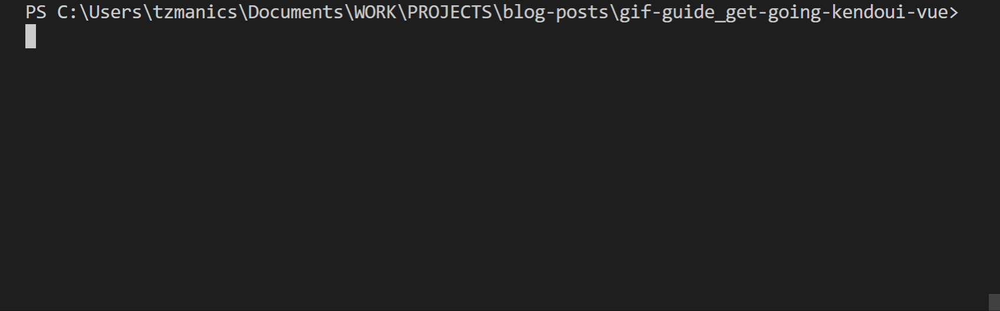

🙌 Possible crisis diverted! The [repo](https://github.com/tzmanics/gif-guide_get-going-kendoui-vue) we used as our `origin` is also going to be our example project that we can follow along with each code change we make in this post. At the end of each section that we change some code, look for the 🐙 emoji to find the link to the commit and see what was changed.

For instance:

🐙[Link to the initial commit.](https://github.com/tzmanics/gif-guide_get-going-kendoui-vue/commit/0645308bd4aad2219071029c286b03190e7bc5e8)

### Install All The Things!

It's time to equip our project with all our fun Kendo UI accoutrements 😉 All we'll need for this project is the `kendo-ui`, `kendo-theme-default`, and `kendo-inputs-vue-wrapper` modules from `npm`. We can install those all in one line with the command:
```bash
npm i @progress/kendo-ui @progress/kendo-default-theme @progess/kendo-inputs-vue-wrapper
```

Since we're using the latest version of [`npm`](https://www.npmjs.com/) (`v5.5.1` at the time of this post), we don't need the `--save` flag to make sure this module is saved as one of our dependencies, `npm` does that by default.

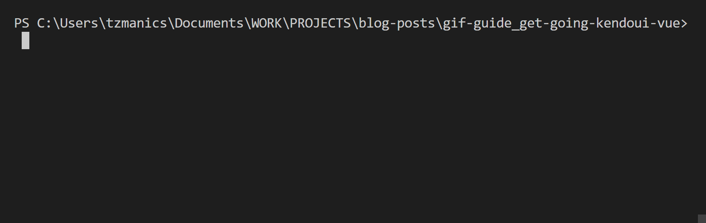

With that we have all our puzzle pieces! Now, let's put this all together.

🐙[Link to the Kendo UI installation commit.](https://github.com/tzmanics/gif-guide_get-going-kendoui-vue/commit/9a2d71e509944f27ac67f3bc353b84f3ba705a9b)

### Importing the Kendo UI Modules
#### Setting Up
Today, to keep things simple, we'll be doing all our edits in the `src/App.vue` & `src/main.js` files but first let's take out the trash 🙊, that is remove some code we don't need. In our `src/App.vue` there is a bunch of content that came with the default install so we can get rid of that.

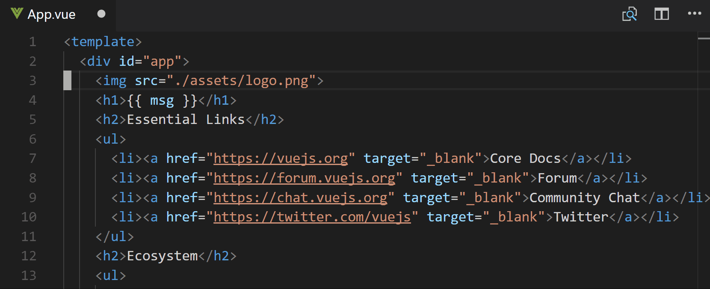 

In our `src/App.vue` file this is all we should have left:

```html
<template>
  <div id="app">
  </div>
</template>

<script>
export default {
  name: 'app',
  data () {
    return {
    }
  }
}
</script>

<style lang="scss">
#app {
  font-family: 'Avenir', Helvetica, Arial, sans-serif;
  -webkit-font-smoothing: antialiased;
  -moz-osx-font-smoothing: grayscale;
  text-align: center;
  color: #2c3e50;
  margin-top: 60px;
}

h1, h2 {
  font-weight: normal;
}

</style>
```
The first thing we deleted was the logo, we want to make sure we delete that unneeded resource as well out of `src/assets/logo.png`. We can do this with the `rm` command:

```bash
rm .\assets\logo.png
```

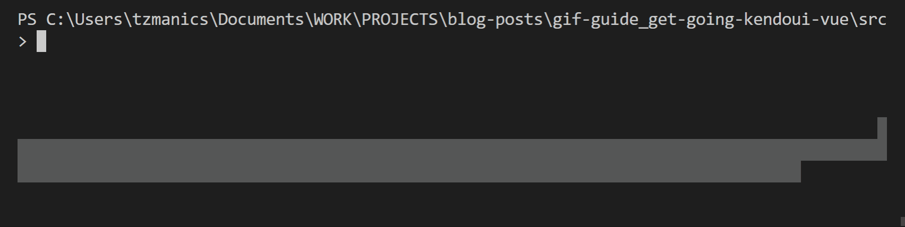

🐙[Link to the deleting things commit.](https://github.com/tzmanics/gif-guide_get-going-kendoui-vue/commit/67a5f3c094e48add7cf7445c86f0db1f42d370f1)

#### Importing All the Kendo UI Fun 🎈

I am a big, big fan of the [Kendo UI default themes](https://docs.telerik.com/kendo-ui/styles-and-layout/sass-themes) because making everything look nice together is hard! The Kendo default theme makes everything look good and also makes it all responsive. Score! One less thing for you to juggle 🤹‍ To add our styling we just need to import the Kendo UI default theme that we installed earlier in our `src/main.js` file. This is also where we import the `kendo-ui` library and the `KendoColorPicker`, so let's do all that now.

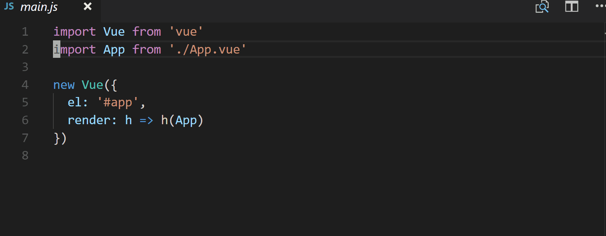 

This is what the `src/main.js` file looks like now:

```js
import Vue from 'vue'
import App from './App.vue'
import { KendoColorPicker } from '@progress/kendo-inputs-vue-wrapper' // 👈
import '@progress/kendo-theme-default/dist/all.css' // 👈
import '@progress/kendo-ui' // 👈

new Vue({
  el: '#app',
  render: h => h(App)
})
```

You can see here when we import the Kendo UI component we specifically asked for the `KendoColorPicker`. The `kendo-inputs-vue-wrapper` library also includes the [ColorPalette](https://docs.telerik.com/kendo-ui-wrappers-vue/components/colorpalette), [FlatColorPicker](https://docs.telerik.com/kendo-ui-wrappers-vue/components/flatcolorpicker), [MaskedTextBox](https://docs.telerik.com/kendo-ui-wrappers-vue/components/maskedtextbox), [NumericTextBox](https://docs.telerik.com/kendo-ui-wrappers-vue/components/numerictextbox), [Slider](https://docs.telerik.com/kendo-ui-wrappers-vue/components/slider), and [Switch](https://docs.telerik.com/kendo-ui-wrappers-vue/components/switch) components 😅, but we only need the `KendoColorPicker` today.

#### Including the `KendoColorPicker` Component

In order for the `KendoColorPicker` component to be used, we're going to register it as a global component and add it to our components collection. We register it using `Vue.component()` and include the components list inside the `new Vue({})` block. You can check out more information about `Vue.component` [here](https://vuejs.org/v2/guide/components.html) 😎

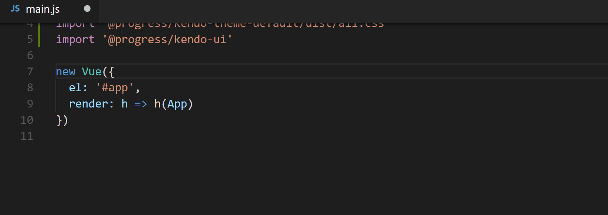

Once, we're done with `src/main.js` it should look like this:

```js
import Vue from 'vue'
import App from './App.vue'
import { KendoColorPicker } from '@progress/kendo-inputs-vue-wrapper'
import '@progress/kendo-theme-default/dist/all.css'
import '@progress/kendo-ui'

Vue.component(KendoColorPicker.name, KendoColorPicker) // 👈

new Vue({
  el: '#app',
  render: h => h(App),
  components: {       // 👈
    KendoColorPicker
  }
})
```

🐙 [Link to the commit where we add the component 👍.](https://github.com/tzmanics/gif-guide_get-going-kendoui-vue/commit/b003ddce6fbbf5a0114694d33d9d1506ae24c667)

### Adding A Color Picker

Okay, we're going to add a color picker UI component real quick. I know, "real quick" sounds unreal 🙄 BUT since we imported the component we only need to add ONE line in the template to add the color picker! This is why I've grown to 💓 Kendo UI components so much, once you understand how to include the components adding them to your project is super easy. So, today we're just adding the `ColorPicker` component but it's basically the same steps with all the fun [Kendo UI for Vue components](https://docs.telerik.com/kendo-ui-wrappers-vue/components/).

1. Use npm to install the module.
2. Import the component we want.
3. Add the component to the template and assign its parameters & events.

I've also added a little `h1` header, because why not 😛 Then we add the color picker component with `<kendo-colorpicker>` and use `v-model` to bind `color`. [Here's](https://vuejs.org/v2/guide/forms.html) more information about what `v-model` does. Then under that in order to display what color was chosen I've added a little span with `v-text` to bind it to whatever color has been chosen in the color picker. Then the very last thing to do is export `color` with a default value down in our `<script>` tags.

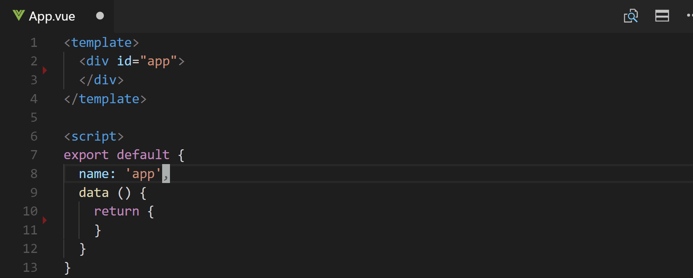

The final version of the `src/App.vue` will look like this:

```html
<template>
  <div id="app">
    <h1> 🌈Fun with Colors🌈 </h1>
    <kendo-colorpicker v-model="color">ColorPicker</kendo-colorpicker>
    color: <span v-text="color"></span>
  </div>
</template>

<script>
export default {
  name: 'app',
  data () {
    return {
      color: "5CE500"
    }
  }
}
</script>

<style lang="scss">
#app {
  font-family: 'Avenir', Helvetica, Arial, sans-serif;
  -webkit-font-smoothing: antialiased;
  -moz-osx-font-smoothing: grayscale;
  text-align: center;
  color: #2c3e50;
  margin-top: 60px;
}

h1, h2 {
  font-weight: normal;
}

</style>

```

🐙 [Link to the commit adding to the template.](https://github.com/tzmanics/gif-guide_get-going-kendoui-vue/commit/e7b1aef1f21a104a0302726c615748c2b7a5165b)

#### Let's 👁 what we've got!

If you still have `npm run dev` running in the background your content at `localhost:8080` should have automatically updated. Otherwise, go ahead and run `npm run dev` again. You should see this lovely site with a color picker there waiting for you.

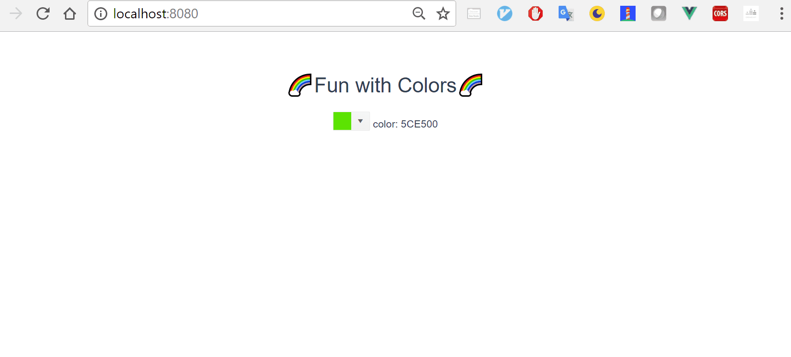

You can see here that without adding any additional CSS we have a fancy looking color picker that's using the default Kendo UI styling so it will match all the other components. All the interactions here where the user can scroll or type out the color they want, come right out the box with no additional JS needed. Pretty cool, right?

### What's Next 🤔
Bravo, you smart cookies 🍪! If you stepped through the code with me you now have a running Vue app using a Kendo UI ColorPicker component. Next you can check out all the [other components](https://docs.telerik.com/kendo-ui-wrappers-vue/components) and see which ones you want to use in your project. Here are some other resources that will help you with your next steps too!

Resources:
- [🐙 Example Project Repo (all the code!)](https://github.com/tzmanics/gif-guide_get-going-kendoui-vue)
- [Kendo UI for Vue.js Getting Started Guide](https://docs.telerik.com/kendo-ui-wrappers-vue/getting-started/getting-started)
- [Application Dashboard Example](https://github.com/telerik/vue-dashboard)
- [Kendo UI Vue.js Wrapper Demos](https://demos.telerik.com/kendo-vue-ui/wrappers/)

Always feel free to reach out to us on Twitter [@KendoUI](https://twitter.com/KendoUI). Thanks so much for coding with me, I can't wait to see all the awesome things you do with Kendo UI & Vue.js! 👋😃

# gif-guide_get-going-kendoui-vue

> A Kendo UI <3 Vue Project

## Build Setup

``` bash
# install dependencies
npm install

# serve with hot reload at localhost:8080
npm run dev

# build for production with minification
npm run build
```

For detailed explanation on how things work, consult the [docs for vue-loader](http://vuejs.github.io/vue-loader).
